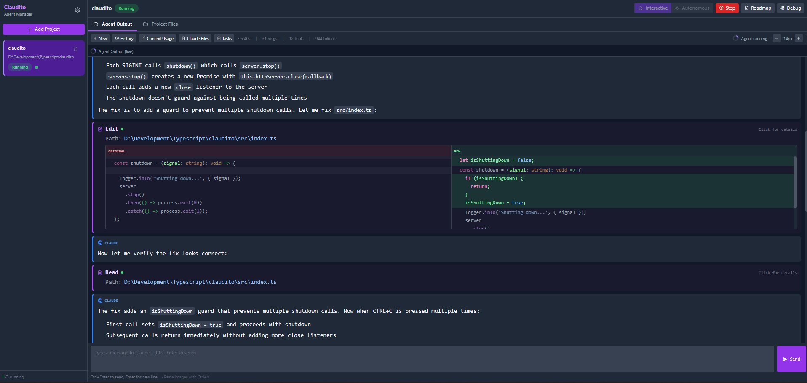

# Superengineer-v5

[](https://www.npmjs.com/package/superengineer-v5)
[](https://github.com/comfortablynumb/superengineer-v5/actions/workflows/ci.yml)
[](https://opensource.org/licenses/MIT)

> **Warning**: This project is under active development. Features may change, and bugs are expected. Use at your own risk.

A web-based manager for [Claude Code](https://docs.anthropic.com/en/docs/claude-code) agents. Run and monitor multiple Claude agents across different projects with a modern UI. Features include Ralph Loop iterative development, Mermaid.js diagram rendering, MCP server configuration, and more.



## Security Considerations

> **Important**: Superengineer-v5 runs Claude Code agents that can execute code and modify files on your system. Take these precautions:

| Scenario | Recommended HOST | Notes |
|----------|------------------|-------|
| **Local development** | `127.0.0.1` or `localhost` | Only accessible from your machine (default) |
| **LAN access** | Your private IP (e.g., `192.168.1.x`) | Accessible from your local network |
| **All interfaces** | `0.0.0.0` | Accessible from anywhere - use with caution |

**Best Practices:**
1. **Use authentication**: Superengineer-v5 requires login by default. Set custom credentials for production:
   ```bash
   SUPERENGINEER_V5_USERNAME=myuser SUPERENGINEER_V5_PASSWORD=mystrongpassword superengineer-v5
   ```
2. **Avoid exposing to the internet**: Use a reverse proxy with HTTPS if needed
3. **Configure firewall rules**: Only allow trusted IP addresses
4. **Review permission rules**: Configure Claude Code permissions to restrict agent capabilities

See [Security Recommendations](#security-recommendations) for more details.

## Quick Start

```bash
# Run directly with npx (no installation required)
npx superengineer-v5

# Or install globally
npm install -g superengineer-v5
superengineer-v5
```

Open your browser at **http://localhost:3000** to access the web UI.

## Table of Contents

- [Security Considerations](#security-considerations)
- [Requirements](#requirements)
- [Installation](#installation)
- [Usage](#usage)
- [Features](#features)
- [Configuration](#configuration)
- [Data Storage](#data-storage)
- [API Reference](#api-reference)
- [Development](#development)
- [Security Recommendations](#security-recommendations)
- [Troubleshooting](#troubleshooting)
- [License](#license)

## Requirements

| Requirement | Version |
|-------------|---------|
| **Node.js** | 20.0.0 or higher |
| **Claude Code CLI** | Latest version |

### Installing and Authenticating Claude Code CLI

Before using Superengineer-v5, you must have the Claude Code CLI installed and **logged in**. Superengineer-v5 works with either:
- **Claude Pro/Max subscription** (recommended for personal use)
- **Anthropic API key** (for API-based usage)

```bash
# Install Claude Code CLI (if not already installed)
npm install -g @anthropic-ai/claude-code

# Verify installation
claude --version

# Log in to Claude Code (required before using Superengineer-v5)
claude auth
```

> **Important:** Superengineer-v5 requires an active Claude Code session. Make sure you can run `claude` directly in your terminal before starting Superengineer-v5.

For more details, see the [Claude Code documentation](https://docs.anthropic.com/en/docs/claude-code).

## Installation

### Option 1: Run with npx (Recommended)

No installation required. Run directly:

```bash
npx superengineer-v5
```

This downloads and runs the latest version automatically.

### Option 2: Global Installation

Install once, run anywhere:

```bash
npm install -g superengineer-v5
superengineer-v5
```

### Option 3: Local Installation

For development or integration into a project:

```bash
npm install superengineer-v5
npx superengineer-v5
```

## Usage

### Basic Usage

```bash
# Start with defaults (localhost:3000)
superengineer-v5

# Specify a custom port
superengineer-v5 --port 8080
superengineer-v5 -p 8080

# Listen on all network interfaces
superengineer-v5 --host 0.0.0.0

# Combine options
superengineer-v5 -p 8080 --host 0.0.0.0
```

### CLI Options

| Option | Short | Description | Default |
|--------|-------|-------------|---------|
| `--port <port>` | `-p` | Server port | `3000` |
| `--host <host>` | `-h` | Server host | `localhost` |
| `--version` | `-v` | Show version number | - |
| `--help` | - | Show help message | - |

### Environment Variables

All options can also be set via environment variables:

```bash
# Linux/macOS
PORT=8080 HOST=0.0.0.0 LOG_LEVEL=debug superengineer-v5

# Windows (PowerShell)
$env:PORT=8080; $env:HOST="0.0.0.0"; superengineer-v5

# Windows (CMD)
set PORT=8080 && set HOST=0.0.0.0 && superengineer-v5
```

| Variable | Default | Description |
|----------|---------|-------------|
| `PORT` | `3000` | Server port |
| `HOST` | `localhost` | Server host |
| `NODE_ENV` | `development` | Environment mode |
| `LOG_LEVEL` | `info` | Log level (debug/info/warn/error) |
| `MAX_CONCURRENT_AGENTS` | `3` | Maximum concurrent agents |
| `DEV_MODE` | `true` (dev) / `false` (prod) | Enable development features |
| `SUPERENGINEER_V5_USERNAME` | (generated) | Override login username |
| `SUPERENGINEER_V5_PASSWORD` | (generated) | Override login password |
| `SUPERENGINEER_V5_FORCE_SHELL_ENABLED` | `0` | Force-enable shell on all interfaces (security risk) |

## Features

### Agent Modes

#### Interactive Mode (Default)
Chat with Claude in real-time. The agent auto-starts when you send your first message.

- Real-time streaming of Claude's responses
- See tool usage as it happens (file reads, edits, bash commands)
- Code diffs with syntax highlighting and inline change highlighting
- Send follow-up messages naturally
- Toggle permission mode (Plan/Accept Edits) at runtime
- Plan mode with approve/reject/request changes options
- **Plan Mode Auto-Continue**: When Claude calls `EnterPlanMode`, the agent automatically restarts in plan mode and sends "Continue" so work proceeds without manual intervention
- Per-project model selection (Claude Sonnet 4/Opus 4/Opus 4.5/Haiku)

#### Ralph Loop Mode (Advanced)
Implements Geoffrey Huntley's "Ralph Wiggum technique" - an iterative worker/reviewer pattern for complex tasks:

- **Worker Phase**: Fresh Claude instance executes the task
- **Reviewer Phase**: Another Claude instance reviews the work and provides structured feedback
- **Iteration**: Worker addresses feedback, reviewer re-evaluates
- **Completion**: Reviewer approves work, max iterations reached, or critical failure
- **Configuration**: Set max iterations, worker/reviewer models, custom prompts
- **Real-time Progress**: Live streaming output from both worker and reviewer
- **History**: View past Ralph Loop executions

Access via the Ralph Loop tab when an agent is running.


### Project Management

- **Add Projects**: Point to any directory with a codebase
- **Import from GitHub**: Browse and search your GitHub repos, clone directly into Claudito as a project
- **GitHub Issues**: Browse project issues with filters, create new issues (with labels, assignees, milestones), "Start Working" sends issue as agent prompt, "Add to Roadmap" creates a task, close issues and add comments
- **GitHub PRs**: Create PRs with auto-generated title/description from conversation history and diff, browse PRs with state filters, view PR detail with reviews and comments, "Fix PR Feedback" sends review feedback as agent prompt
- **Multi-Project Support**: Manage multiple projects simultaneously
- **Concurrent Execution**: Run multiple agents at once (configurable limit)
- **Queue System**: Automatic queuing when at max capacity

### Authentication

Superengineer-v5 includes built-in authentication to protect your agent manager:

- **Auto-generated credentials**: On each server start, a unique username and password are generated
- **QR Code login**: Scan the QR code displayed in the terminal for quick access
- **Session persistence**: Sessions last 7 days
- **Custom credentials**: Set `SUPERENGINEER_V5_USERNAME` and `SUPERENGINEER_V5_PASSWORD` environment variables for persistent credentials
- **Logout**: Click the logout button in the sidebar header

### User Interface

| Feature | Description |
|---------|-------------|
| **Tabbed Interface** | Switch between Agent Output, Project Files, Shell, Git, Ralph Loop, and Run Configs |
| **Shell Terminal** | Full PTY terminal with directory restriction to project folder |
| **File Browser** | Browse, view, edit, create, delete files and folders. Folder browser includes a "New Folder" button for creating directories inline while browsing |
| **Syntax Highlighting** | 30+ languages supported via highlight.js |
| **Tool Visualization** | See Claude's tool usage with icons and arguments |
| **Code Diffs** | Side-by-side diff view with word-level inline change highlighting |
| **Context Monitor** | View token usage and context window utilization |
| **Task Tracking** | View Claude's current tasks and progress |
| **Project Optimizations** | Check for CLAUDE.md issues and optimization suggestions |
| **One-Off Agent Tabs** | Interactive sub-tabs with full rendering, per-tab toolbar (Tasks, Search, Permission Mode, Model, Font Size), and tool result previews |
| **Font Controls** | Adjust text size with +/- buttons |
| **Keyboard Shortcuts** | Configurable keybindings (Ctrl+Enter or Enter to send) |
| **Image Support** | Paste or drag-and-drop images into messages |
| **Mobile Support** | Responsive design with collapsible sidebar, full-screen file/diff browsing |
| **Permission Mode Toggle** | Switch between Plan and Accept Edits modes at runtime |
| **Desktop Notifications** | Get notified when agent needs input (optional) |
| **Hidden Files Toggle** | Show/hide dotfiles and hidden folders in file browser |
| **Quick Actions** | Keyboard shortcut buttons for common actions (New Project, Ralph Loop) |
| **Prompt Templates** | Reusable message templates with interpolation variables |

### Git Integration

Full Git support directly in the UI:

| Feature | Description |
|---------|-------------|
| **Branch Management** | View, switch, and create branches |
| **File Staging** | Stage/unstage individual files or entire directories |
| **Commit** | Write commit messages and commit changes |
| **Push/Pull** | Sync with remote repositories |
| **Diff Preview** | Side-by-side diff view with inline word-level highlighting |
| **Tag Management** | Create and push tags |
| **Context Menu** | Right-click files/folders for quick actions |
| **Operation Blocking** | UI blocks during git operations to prevent conflicts |

### Real-time Features

- **Live Streaming**: WebSocket-based real-time updates
- **Conversation Stats**: Duration, message count, tool calls, tokens
- **Resource Monitor**: Running and queued agent counts
- **Context Usage**: Token usage persisted even when agent is stopped
- **Session Recovery**: Automatic recovery when Claude sessions are lost

### Diff Visualization

- **Side-by-Side View**: Original and modified content displayed side by side
- **Inline Change Highlighting**: Word-level diff showing exactly what changed within modified lines
- **Color Coding**: Red for removed, green for added, orange for modified lines
- **Syntax Highlighting**: Language-aware highlighting preserved in diffs

### Shell Terminal

A full PTY-based terminal integrated into the UI:

| Feature | Description |
|---------|-------------|
| **PTY Support** | True terminal emulation with proper input handling |
| **Directory Restriction** | Users cannot navigate outside the project folder |
| **Resize Support** | Terminal resizes with the browser window |
| **PowerShell/Bash** | Uses PowerShell on Windows, bash on Unix |
| **Session Persistence** | Shell sessions persist while browsing other tabs |

> **Security Note**: The shell terminal is **automatically disabled** when the server is bound to all interfaces (`0.0.0.0`). This prevents remote shell access. To enable shell on all interfaces, set `SUPERENGINEER_V5_FORCE_SHELL_ENABLED=1` (not recommended).

### Run Configurations

Per-project named shell commands (similar to JetBrains IDE run configurations) with live output streaming:

| Feature | Description |
|---------|-------------|
| **Named Commands** | Define reusable shell commands per project (e.g. dev server, test watcher) |
| **Import from Project** | Scan package.json, Cargo.toml, go.mod, Makefile, pyproject.toml and import configs |
| **Live Output** | xterm.js terminal per configuration with full color and ANSI support |
| **Start/Stop** | One-click start and stop with real-time status badges |
| **Auto-Restart** | Automatically restart on failure with configurable delay and max retries |
| **Pre-Launch Chains** | Run dependent configurations before starting (with cycle detection) |
| **Environment Variables** | Custom env vars per configuration |
| **Working Directory** | Relative to project root, validated to prevent path traversal |
| **Shell Override** | Use a specific shell (defaults to cmd.exe on Windows, $SHELL on Unix) |

Access via the **Run** tab in the main UI.

### Inventify - Project Idea Generator

Generate new project ideas and have them automatically built:

1. Click the lightbulb icon in the sidebar
2. Select project types (Web App, API, CLI, Desktop, Mobile, Library, Extension)
3. Select themes (Games, Enterprise, Dev Tools, Education, Social, Finance, Health, Creative, Data, IoT)
4. Click "Generate!" -- a one-off agent brainstorms **5 unique project ideas**, each with a name, tagline, and description
5. Browse the 5 idea cards, select one with the radio button, and click "Build this idea"
6. A one-off agent suggests **5 creative project names** -- select one and click "Start building"
7. Creates the project directory, writes `doc/plan.md` with a detailed plan, registers in Claudito, starts a Ralph Loop to build it, and automatically navigates to the new project

Configure the output folder in Settings > General > Inventify Folder.

### Additional Features

- **CLAUDE.md Editor**: Edit global and project-specific CLAUDE.md files with preview and AI-powered optimization
- **One-Off Agent Sub-Tabs**: Background agent tasks appear as interactive sub-tabs in Agent Output with full tool rendering, per-tab toolbar (Tasks with badge, Search with highlighting, Permission Mode, Model selector, Font Size controls), per-tab input matching main tab (rows=3, cancel+send buttons, hint text), and agent lifecycle management. Shared controls (Permission Mode, Model, Font Size) sync across all tabs. Optimization uses direct file editing via Claude's Edit tool
- **Conversation History**: Browse, restore, and rename previous conversations
- **AskUserQuestion Support**: Interactive UI for Claude's AskUserQuestion tool — renders questions with clickable options, "Other" for custom text, multi-question support, answers sent as tool_result
- **Session Resumption**: Resume Claude sessions across restarts
- **Debug Panel**: View logs, Claude I/O, process info, and troubleshoot issues
- **Optimizations Check**: Detect missing or oversized CLAUDE.md files
- **Append System Prompt**: Add custom instructions to Claude's system prompt
- **Offline Ready**: All assets served locally (no CDN dependencies)
- **Graceful Shutdown**: Properly stops agents and saves state on exit
- **PID Tracking**: Tracks agent processes and cleans up orphans on startup
- **Mermaid.js Support**: Render Mermaid diagrams directly in Claude's output
- **MCP Server Configuration**: Configure Model Context Protocol servers for Claude
- **Plugin Support**: Load Claude Code plugins (e.g., bundled mermaid skill)

## Configuration

### Global Settings

Access settings via the gear icon in the UI sidebar.

| Setting | Description | Default |
|---------|-------------|---------|
| `maxConcurrentAgents` | Maximum simultaneous agents (1-10) | `3` |
| `sendWithCtrlEnter` | Ctrl+Enter sends (true) or Enter sends (false) | `true` |
| `historyLimit` | Max conversations in history | `25` |
| `agentPromptTemplate` | Template for agent instructions | (see below) |
| `defaultModel` | Default Claude model for agents | `claude-opus-4-6` |
| `appendSystemPrompt` | Custom text appended to Claude's system prompt | `""` |
| `inventifyFolder` | Parent directory where Inventify creates new projects | `""` |

### Permission Configuration

Control what Claude agents can do without prompting. Access via Settings > Claude Code Permissions.

> **⚠️ Important Limitation**: Superengineer-v5 currently only supports **Accept Edits** and **Plan** permission modes. The **Default** mode (which prompts for permission on each action) is not yet supported because Superengineer-v5 cannot currently handle Claude's permission prompts. We're working on adding this functionality in a future release.

#### Permission Modes

| Mode | Description | Supported |
|------|-------------|-----------|
| `acceptEdits` | Auto-approve file edits | ✅ Yes |
| `plan` | Review plan before execution | ✅ Yes |
| `default` | Ask for each action | ❌ Not yet |

#### Permission Rules

Rules follow the format: `Tool` or `Tool(specifier)`

**Examples:**
- `Read` - Allow all file reads
- `Bash(npm run:*)` - Allow npm run commands
- `Bash(git status)` - Allow specific command
- `Read(./.env)` - Deny reading .env files (use in deny rules)

#### Allow Rules (auto-approve)
Tools that execute without prompting:
```
Read
Glob
Grep
Bash(npm run:*)
Bash(git status)
Bash(git diff:*)
```

#### Deny Rules (block)
Tools that are blocked entirely (take priority over allow rules):
```
Read(./.env)
Read(./.env.*)
Bash(rm -rf:*)
Bash(curl:*)
```

#### Quick Presets

| Preset | Description |
|--------|-------------|
| Safe Development | Common dev tools, blocks dangerous commands |
| Git Only | Read access + git commands |
| Read Only | File reading only, no writes or commands |
| Clear All | Remove all rules |

#### Skip All Permissions (Legacy)

The "Skip ALL permission prompts" toggle uses `--dangerously-skip-permissions` which bypasses all checks. This is not recommended for production use.

#### Per-Project Overrides

Each project can have its own permission overrides that extend the global rules. Access via the project's settings menu.

### Prompt Templates

Create reusable message templates with dynamic fields. Access via Settings > Templates.

**Variable syntax**: `${type:name}` or `${type:name:options}`

- `${text:varname}` - Single-line text input
- `${textarea:varname}` - Multi-line textarea
- `${select:varname:opt1,opt2,opt3}` - Dropdown select
- `${checkbox:varname}` - Boolean checkbox

**Usage**: Click template button near input → select template → fill variables → insert

**Default templates**: Code Review, Bug Fix Request, Feature Implementation, Refactoring Request, Documentation Request

### MCP (Model Context Protocol) Servers

Configure MCP servers to extend Claude's capabilities. Access via Settings > MCP Servers.

**MCP Server Configuration**:
- **Name**: Display name for the server
- **Type**: `stdio` (local command) or `http` (remote API)
- **Command/URL**: Server executable or API endpoint
- **Arguments**: Command-line arguments (stdio only)
- **Environment**: Environment variables
- **Enabled**: Toggle server on/off

**Example stdio server**:
```json
{
  "name": "GitHub MCP",
  "type": "stdio",
  "command": "npx",
  "args": ["-y", "@modelcontextprotocol/server-github"],
  "env": { "GITHUB_TOKEN": "your-token" }
}
```

### Chrome Browser

Toggle Chrome browser usage for Claude agents via the **Chrome** button in the conversation toolbar (next to MCP Servers). When enabled, passes `--chrome` to Claude CLI; when disabled, passes `--no-chrome`. The setting is saved globally and applies to all new agent sessions (interactive, one-off, and autonomous).

### Danger Zone (Factory Reset)

Access via Settings > Danger Zone. The "Wipe All Data" button permanently deletes:
- All project registrations and per-project `.claudito/` directories
- All conversation history
- Global settings, PID tracking, and project index (`~/.claudito/`)
- Temporary MCP config files (`{OS_TEMP}/claudito-mcp/`)

Project source files are **never** deleted.

### Agent Prompt Template

Customize how instructions are given to agents. Available variables:

- `${var:project-name}` - Project name
- `${var:phase-title}` - Current phase from ROADMAP.md
- `${var:milestone-title}` - Current milestone title
- `${var:milestone-item}` - Specific task to work on

## Data Storage

All data is stored locally in your home directory:

```
~/.superengineer-v5/
├── projects/
│   └── index.json          # Project registry
├── settings.json           # Global settings
└── pids.json              # Active process tracking

{project-root}/.superengineer-v5/
├── status.json            # Project status
└── conversations/
    └── {id}.json          # Conversation history
```

## API Reference

### Health Check

```
GET /api/health
```

### Integrations

```
GET  /api/integrations/github/status              # GitHub CLI installation & auth status
GET  /api/integrations/github/repos               # List repos (?owner=&language=&limit=)
GET  /api/integrations/github/repos/search        # Search repos (?query=&language=&sort=&limit=)
POST /api/integrations/github/clone               # Clone repo and register as project
GET  /api/integrations/github/issues              # List issues (?repo=&state=&label=&assignee=&milestone=&limit=)
GET  /api/integrations/github/issues/:num         # Issue detail with comments (?repo=)
POST /api/integrations/github/issues              # Create issue (body: {repo, title, body?, labels?, assignees?, milestone?})
POST /api/integrations/github/issues/:num/close   # Close issue (?repo=)
POST /api/integrations/github/issues/:num/comment # Add comment (?repo=, body: {body})
GET  /api/integrations/github/labels              # List repo labels (?repo=)
GET  /api/integrations/github/milestones          # List repo milestones (?repo=)
GET  /api/integrations/github/collaborators       # List repo collaborators (?repo=)
POST /api/integrations/github/pr                  # Create PR (body: repo, title, body, base?, draft?)
GET  /api/integrations/github/pulls               # List PRs (?repo=&state=&limit=)
GET  /api/integrations/github/pulls/:num          # PR detail with reviews & comments (?repo=)
```

### Projects

```
GET    /api/projects              # List all projects
POST   /api/projects              # Create project
GET    /api/projects/:id          # Get project details
DELETE /api/projects/:id          # Delete project
```

### Agent Control

```
POST   /api/projects/:id/agent/start       # Start agent
POST   /api/projects/:id/agent/stop        # Stop agent
POST   /api/projects/:id/agent/oneoff/:oneOffId/stop  # Stop one-off agent
POST   /api/projects/:id/agent/oneoff/:oneOffId/send  # Send message to one-off agent
GET    /api/projects/:id/agent/oneoff/:oneOffId/status # Get one-off agent status
GET    /api/projects/:id/agent/oneoff/:oneOffId/context # Get one-off agent context
POST   /api/projects/:id/agent/send        # Send message
POST   /api/projects/:id/agent/answer     # Answer AskUserQuestion (tool_result)
GET    /api/projects/:id/agent/status      # Get status
GET    /api/projects/:id/agent/context     # Get context usage
```

### Roadmap

```
GET    /api/projects/:id/roadmap           # Get roadmap
POST   /api/projects/:id/roadmap/generate  # Generate roadmap
PUT    /api/projects/:id/roadmap           # Modify roadmap
POST   /api/projects/:id/roadmap/task      # Add a task to a milestone
DELETE /api/projects/:id/roadmap/task      # Delete a task
DELETE /api/projects/:id/roadmap/milestone # Delete a milestone
DELETE /api/projects/:id/roadmap/phase     # Delete a phase
```

### Ralph Loop

```
POST   /api/projects/:id/ralph-loop/start  # Start Ralph Loop
POST   /api/projects/:id/ralph-loop/:taskId/stop   # Stop Ralph Loop
POST   /api/projects/:id/ralph-loop/:taskId/pause  # Pause Ralph Loop
POST   /api/projects/:id/ralph-loop/:taskId/resume # Resume Ralph Loop
GET    /api/projects/:id/ralph-loop        # List all Ralph Loops
GET    /api/projects/:id/ralph-loop/:taskId # Get Ralph Loop state
DELETE /api/projects/:id/ralph-loop/:taskId # Delete Ralph Loop
```

### Git Operations

```
GET    /api/projects/:id/git/status        # Get repository status
GET    /api/projects/:id/git/branches      # List branches
POST   /api/projects/:id/git/checkout      # Switch branch
POST   /api/projects/:id/git/branch        # Create branch
POST   /api/projects/:id/git/stage         # Stage file(s)
POST   /api/projects/:id/git/stage-all     # Stage all changes
POST   /api/projects/:id/git/unstage       # Unstage file(s)
POST   /api/projects/:id/git/unstage-all   # Unstage all changes
POST   /api/projects/:id/git/discard       # Discard changes
POST   /api/projects/:id/git/commit        # Commit staged changes
POST   /api/projects/:id/git/push          # Push to remote
POST   /api/projects/:id/git/pull          # Pull from remote
GET    /api/projects/:id/git/diff          # Get file diff
GET    /api/projects/:id/git/tags          # List tags
POST   /api/projects/:id/git/tags          # Create tag
POST   /api/projects/:id/git/tags/push     # Push tag to remote
POST   /api/projects/:id/git/generate-pr-description # Auto-generate PR title/body from conversation + diff
```

### File System

```
GET    /api/fs/drives                      # List available drives
GET    /api/fs/browse                      # Browse directory (dirs only)
GET    /api/fs/browse-with-files           # Browse with files
GET    /api/fs/read                        # Read file content
PUT    /api/fs/write                       # Write file content
DELETE /api/fs/delete                      # Delete file or folder
```

### Shell

```
POST   /api/projects/:id/shell/start       # Start shell session
GET    /api/projects/:id/shell/status      # Get shell status
POST   /api/projects/:id/shell/input       # Send input to shell
POST   /api/projects/:id/shell/resize      # Resize terminal
POST   /api/projects/:id/shell/stop        # Stop shell session
```

### Run Configurations

```
GET    /api/projects/:id/run-configs                  # List all configs
GET    /api/projects/:id/run-configs/importable       # Scan project files for importable configs
POST   /api/projects/:id/run-configs                  # Create config
PUT    /api/projects/:id/run-configs/:configId        # Update config
DELETE /api/projects/:id/run-configs/:configId        # Delete config
POST   /api/projects/:id/run-configs/:configId/start  # Start process
POST   /api/projects/:id/run-configs/:configId/stop   # Stop process
GET    /api/projects/:id/run-configs/:configId/status  # Get process status
```

### Inventify

```
POST   /api/projects/inventify/start             # Start brainstorming (body: projectTypes[], themes[])
GET    /api/projects/inventify/ideas             # Get generated idea cards (5 ideas)
POST   /api/projects/inventify/suggest-names     # Suggest 5 names for idea (body: selectedIndex)
GET    /api/projects/inventify/name-suggestions  # Get pending name suggestions
POST   /api/projects/inventify/select            # Select idea + name to build (body: selectedIndex, projectName)
POST   /api/projects/inventify/cancel            # Cancel current inventify operation
```

### Authentication

```
POST   /api/auth/login                     # Login with credentials
POST   /api/auth/logout                    # Logout current session
GET    /api/auth/check                     # Check session validity
```

### Settings

```
GET    /api/settings              # Get settings
PUT    /api/settings              # Update settings
GET    /api/settings/models       # Get available Claude models
POST   /api/settings/wipe-all-data # Wipe all Claudito data (factory reset)
```

### Claude Files

```
GET    /api/projects/:id/claude-files      # Get CLAUDE.md files
PUT    /api/projects/:id/claude-files      # Save CLAUDE.md file
```

### Permission Management

```
GET    /api/projects/:id/permissions       # Get project permission overrides
PUT    /api/projects/:id/permissions       # Update project permissions
```

### Model Configuration

```
GET    /api/projects/:id/model             # Get project model configuration
PUT    /api/projects/:id/model             # Update project model override
```

### WebSocket

Connect to `ws://localhost:3000` for real-time updates:

```javascript
const ws = new WebSocket('ws://localhost:3000');

// Subscribe to project updates
ws.send(JSON.stringify({ type: 'subscribe', projectId: 'your-project-id' }));

// Message types received:
// - agent_message: Real-time agent output
// - agent_status: Status changes (running/stopped/error)
// - agent_waiting: Agent waiting for input (with version for sync)
// - queue_change: Queue updates
// - roadmap_message: Roadmap generation output
// - github_clone_progress: Clone progress updates (phase, message)
// - session_recovery: Session couldn't be resumed, new conversation created
// - shell_output: Shell terminal output
// - shell_exit: Shell session exited
// - shell_error: Shell error occurred
// - ralph_loop_status: Ralph Loop status changes
// - ralph_loop_iteration: Ralph Loop iteration started
// - ralph_loop_output: Ralph Loop real-time worker/reviewer output
// - ralph_loop_complete: Ralph Loop finished
// - ralph_loop_error: Ralph Loop error occurred
// - oneoff_message: One-off agent output (routed to sub-tabs)
// - oneoff_status: One-off agent status changes
// - oneoff_waiting: One-off agent waiting for input
// - run_config_output: Run config process output (configId, data)
// - run_config_status: Run config process status change (configId, status)
```

## Development

### Setup

```bash
git clone https://github.com/comfortablynumb/superengineer-v5.git
cd superengineer-v5
npm install
```

### Commands

| Command | Description |
|---------|-------------|
| `npm run dev` | Start development server with hot reload |
| `npm run build` | Build TypeScript to dist/ |
| `npm start` | Run production build |
| `npm test` | Run all tests |
| `npm run test:coverage` | Run tests with coverage |
| `npm run lint` | Run ESLint |
| `npm run lint:fix` | Fix ESLint issues |
| `npm run format` | Format code with Prettier |

### Project Structure

```
superengineer-v5/
├── src/
│   ├── index.ts          # Library entry point
│   ├── cli.ts            # CLI entry point
│   ├── config/           # Configuration loading
│   ├── server/           # Express server
│   ├── routes/           # API routes
│   ├── services/         # Business logic
│   ├── repositories/     # Data persistence
│   ├── agents/           # Claude agent management
│   ├── websocket/        # WebSocket server
│   └── utils/            # Utilities
├── public/               # Static frontend assets
├── test/                 # Test files
├── doc/                  # Documentation
└── superengineer-v5-plugin/      # Bundled Claude Code plugin
    ├── plugin.json       # Plugin manifest
    └── skills/           # Plugin skills
        └── mermaid.md    # Mermaid diagram generation skill
```

## Testing the Package Locally

Before publishing, you can test the package locally to verify everything works correctly.

### Method 1: npm pack (Recommended)

Create a tarball and install it:

```bash
# Build the project
npm run build

# Create the package tarball
npm pack

# This creates superengineer-v5-0.1.0.tgz (version may vary)

# Install globally from the tarball
npm install -g ./superengineer-v5-0.1.0.tgz

# Test the CLI
superengineer-v5 --help
superengineer-v5 --version
superengineer-v5  # Starts the server

# Uninstall when done
npm uninstall -g superengineer-v5
```

### Method 2: npm link

Create a symlink for development:

```bash
# Build first
npm run build

# Create global symlink
npm link

# Now 'superengineer-v5' command is available globally
superengineer-v5 --help
superengineer-v5

# Unlink when done
npm unlink -g superengineer-v5
```

### Method 3: Dry Run

Preview what would be published without creating a file:

```bash
# See what files would be included
npm pack --dry-run

# Check package size and contents
npm publish --dry-run
```

### Method 4: Local npx

Test as if running with npx:

```bash
# Build the project
npm run build

# Run the CLI directly
node dist/cli.js --help
node dist/cli.js

# Or use npm script
npm run cli -- --help
npm run cli -- --port 8080
```

### Verifying the Package Contents

Check that the package includes everything needed:

```bash
# List all files that will be published
npm pack --dry-run 2>&1 | grep "npm notice"

# Expected contents:
# - dist/          (compiled JavaScript)
# - public/        (frontend assets)
# - README.md
# - LICENSE
# - package.json
```

### Testing in a Clean Environment

For thorough testing, install in an isolated directory:

```bash
# Create test directory
mkdir /tmp/superengineer-v5-test
cd /tmp/superengineer-v5-test

# Install from tarball
npm init -y
npm install /path/to/superengineer-v5-0.1.0.tgz

# Run via npx
npx superengineer-v5 --help

# Clean up
cd ..
rm -rf /tmp/superengineer-v5-test
```

## Security Recommendations

### Network Binding

By default, Superengineer-v5 binds to `localhost` which only accepts connections from the local machine. When exposing Superengineer-v5 to other devices, consider these recommendations:

| Scenario | Recommended HOST | Notes |
|----------|------------------|-------|
| **Local development** | `127.0.0.1` or `localhost` | Only accessible from your machine |
| **LAN access** | Your private IP (e.g., `192.168.1.x`) | Accessible from your local network |
| **All interfaces** | `0.0.0.0` | Accessible from anywhere - use with caution |

```bash
# Local only (most secure)
superengineer-v5 --host 127.0.0.1

# Specific network interface (LAN access)
superengineer-v5 --host 192.168.1.100

# All interfaces (least secure - requires authentication)
superengineer-v5 --host 0.0.0.0
```

### Best Practices

1. **Use authentication**: Superengineer-v5 requires login by default. Set custom credentials via environment variables for production use:
   ```bash
   SUPERENGINEER_V5_USERNAME=myuser SUPERENGINEER_V5_PASSWORD=mystrongpassword superengineer-v5
   ```

2. **Avoid exposing to the internet**: Superengineer-v5 is designed for local/LAN use. If you must expose it, use a reverse proxy with HTTPS.

3. **Firewall rules**: When using LAN access, configure your firewall to only allow trusted IP addresses.

4. **Review permission rules**: Configure Claude Code permission rules to restrict what agents can do.

## Troubleshooting

### "claude: command not found"

The Claude Code CLI is not installed or not in your PATH:

```bash
npm install -g @anthropic-ai/claude-code
```

### Port already in use

Another process is using port 3000:

```bash
# Use a different port
superengineer-v5 --port 3001

# Or find and kill the process using port 3000
# Linux/macOS:
lsof -i :3000
kill -9 <PID>

# Windows:
netstat -ano | findstr :3000
taskkill /PID <PID> /F
```

### Agent not responding

Check the Debug panel (gear icon > Debug) to view:
- Process status and PID
- Recent logs
- Last executed command

### Mermaid diagrams not rendering

Ensure that:
1. You're using the `mermaid` language identifier in code blocks
2. The diagram syntax is valid (check browser console for errors)
3. Try refreshing the page if diagrams appear as "[object Object]"

### Ralph Loop not working

Verify that:
1. An agent is running for the project
2. You've provided a clear task description
3. Worker and reviewer models are selected
4. Check the Ralph Loop output for specific errors

## Contributing

1. Fork the repository
2. Create a feature branch (`git checkout -b feature/amazing-feature`)
3. Commit your changes (`git commit -m 'Add amazing feature'`)
4. Push to the branch (`git push origin feature/amazing-feature`)
5. Open a Pull Request

## License

MIT License - see [LICENSE](LICENSE) for details.

---

Made with Claude Code
