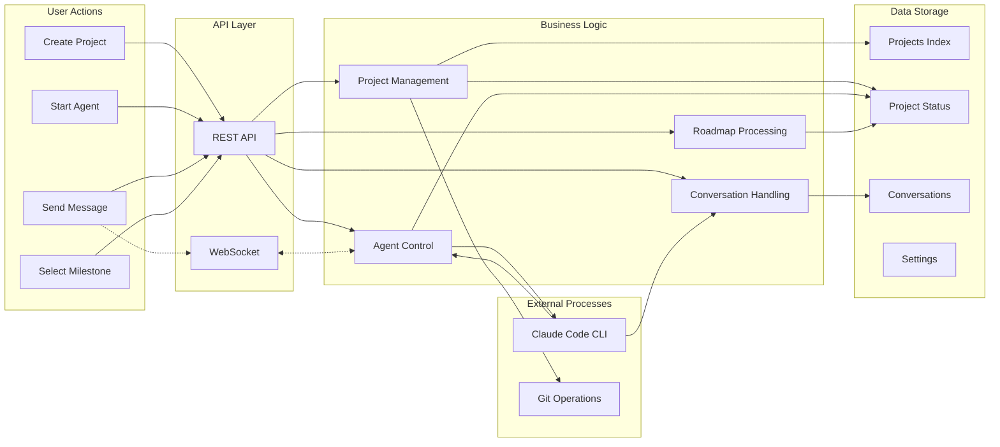
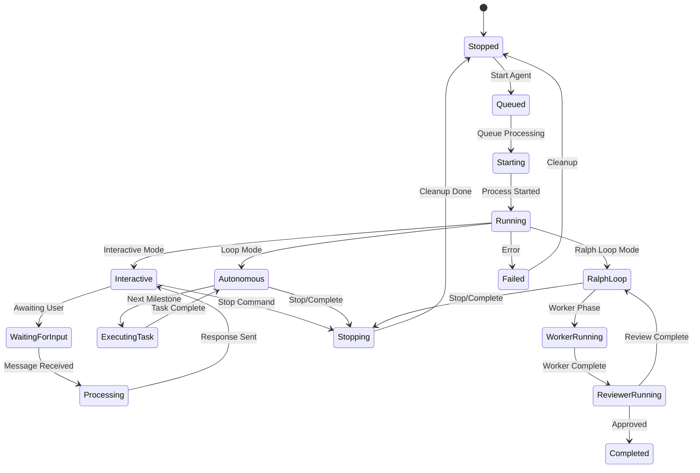
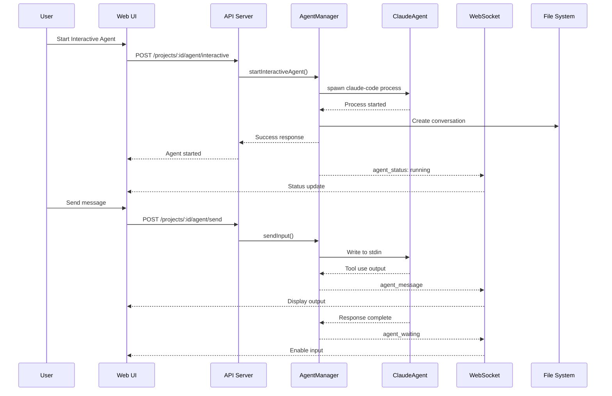
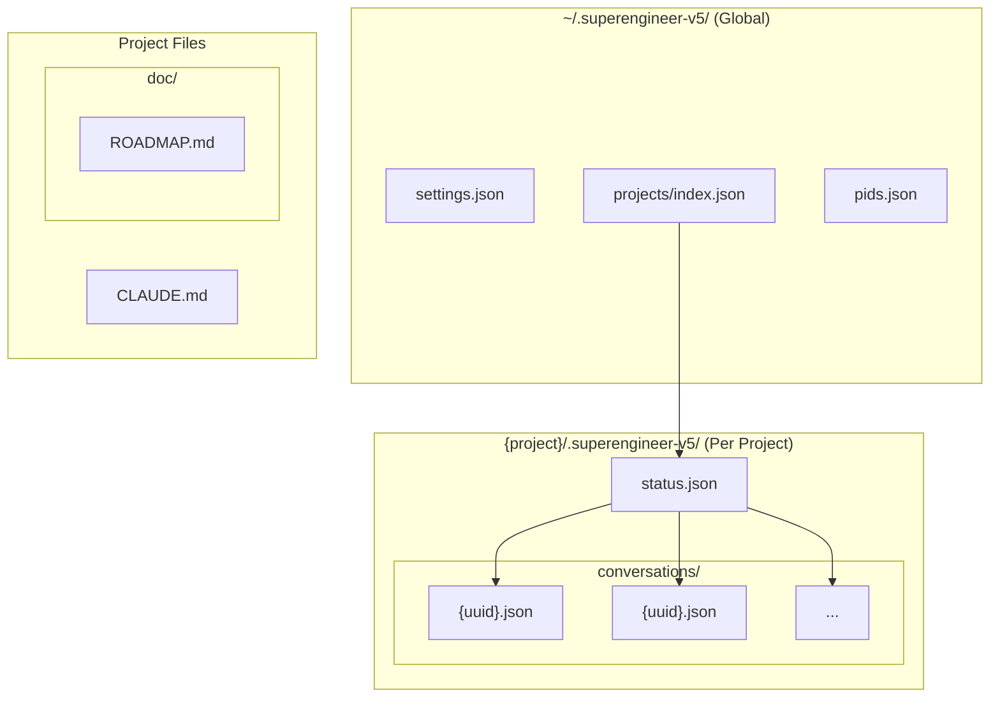

# Superengineer Architecture Diagram

**Note**: When creating Mermaid diagrams, avoid these common syntax errors:
- Don't use curly braces `{}` in node labels (they define rhombus shapes)
- Don't use quotes in subgraph names
- Replace special characters like `<>` and backslashes
- Use simple alphanumeric IDs for subgraphs

## System Overview

```mermaid
graph TB
    subgraph "Frontend (Browser)"
        UI[Web UI<br/>jQuery + Tailwind CSS]
        WC[WebSocket Client]
    end

    subgraph "Backend (Node.js/Express)"
        HTTP[Express HTTP Server<br/>:3000]
        WS[WebSocket Server]

        subgraph "API Routes"
            PR[Projects Routes]
            SR[Settings Routes]
            FSR[Filesystem Routes]
            AR[Agents Routes]
            GR[Git Routes]
            RLR[Ralph Loop Routes]
        end

        subgraph "Core Services"
            PM[ProjectService]
            AM[AgentManager]
            RP[RoadmapParser]
            RG[RoadmapGenerator]
            IG[InstructionGenerator]
            GS[GitService]
            RLS[RalphLoopService]
            EM[EventManager]
        end

        subgraph "Repositories"
            PRepo[ProjectRepository]
            CRepo[ConversationRepository]
            SRepo[SettingsRepository]
        end

        subgraph "Agent Management"
            CA[ClaudeAgent<br/>Claude Code CLI Process]
            AQ[Agent Queue]
            PC[Process Controller]
        end
    end

    subgraph "File System"
        GD[Global Data<br/>~/.superengineer-v5/]
        PD[Project Data<br/>{project}/.superengineer-v5/]
        PF[Project Files]
    end

    subgraph "External"
        CC[Claude Code CLI]
        Git[Git Repository]
    end

    %% Frontend connections
    UI --> HTTP
    UI <--> WC
    WC <--> WS

    %% HTTP Server connections
    HTTP --> PR
    HTTP --> SR
    HTTP --> FSR
    HTTP --> AR
    HTTP --> GR
    HTTP --> RLR

    %% Route to Service connections
    PR --> PM
    PR --> AM
    PR --> RP
    PR --> RG
    PR --> IG
    PR --> GS
    PR --> RLS
    AR --> AM
    GR --> GS
    RLR --> RLS

    %% Service to Repository connections
    PM --> PRepo
    AM --> CRepo
    SR --> SRepo
    RLS --> PRepo

    %% AgentManager connections
    AM --> CA
    AM --> AQ
    AM --> PC
    AM --> EM

    %% WebSocket connections
    WS --> AM
    WS --> EM

    %% File system connections
    PRepo --> GD
    PRepo --> PD
    CRepo --> PD
    SRepo --> GD
    CA --> PF
    GS --> PF

    %% External connections
    CA --> CC
    GS --> Git

    %% Event flow
    EM -.->|Events| WS
    CA -.->|Output| AM
    AM -.->|Status| WS
```

## Data Flow Diagram



## Agent Lifecycle Diagram



## Component Interaction Diagram



## Data Storage Structure



## Key Features Flow

```mermaid
flowchart TB
    subgraph "Ralph Loop Feature"
        RLStart[Start Ralph Loop] --> RLWorker[Worker Agent Executes]
        RLWorker --> RLReview[Reviewer Agent Evaluates]
        RLReview --> RLDecision{Review Decision}
        RLDecision -->|Reject| RLWorker
        RLDecision -->|Approve| RLComplete[Task Complete]
        RLDecision -->|Fail| RLFailed[Task Failed]
    end

    subgraph "Permission System"
        PM1[Global Permissions] --> PM2[Project Overrides]
        PM2 --> PM3[Runtime Mode]
        PM3 --> PM4{Permission Check}
        PM4 -->|Allow| PMAllow[Execute Tool]
        PM4 -->|Deny| PMDeny[Block Execution]
    end

    subgraph "Session Management"
        SM1[New Conversation] --> SM2[Generate UUID]
        SM2 --> SM3[Start Claude Session]
        SM3 --> SM4[Track in status.json]
        SM4 --> SM5[WebSocket Updates]
    end
```



This architecture diagram shows:

1. **System Overview**: The main components and their relationships
2. **Data Flow**: How user actions flow through the system
3. **Agent Lifecycle**: The various states an agent can be in
4. **Component Interaction**: A typical sequence of interactions
5. **Data Storage Structure**: How data is organized on disk
6. **Key Features Flow**: Important feature implementations like Ralph Loop and permissions

The project follows a clean architecture with:
- Clear separation between frontend and backend
- Repository pattern for data access
- Service layer for business logic
- Event-driven architecture for real-time updates
- Process management for external Claude Code CLI integration